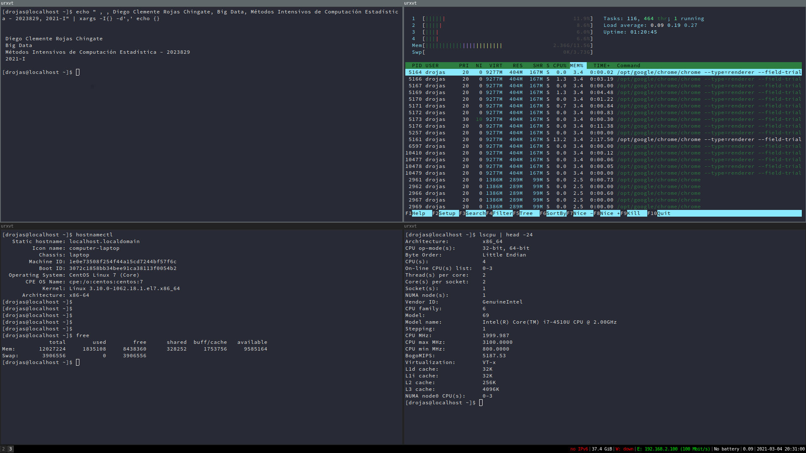

## MATERIA:
### Big Data – Métodos Intensivos de Computación Estadística -2023829
## TAREA:
### Instalar una máquina virtual y Ubuntu 20.04 en Windows

Desde hace poco mas de 2 años (desde 2019) he venido utilizando la distribución Centos 7 de Linux con Dual-Boot con Windows, por lo cual no realicé la instalación de una maquina virtual en Windows y decidí desarrollar este curso con esta distribución, dado que además de la comodidad y facilidad, tengo mayor destreza con esta distribución.

Como evidencia de la tarea, dejo el siguiente pantallazo con los datos de mi equipo:

