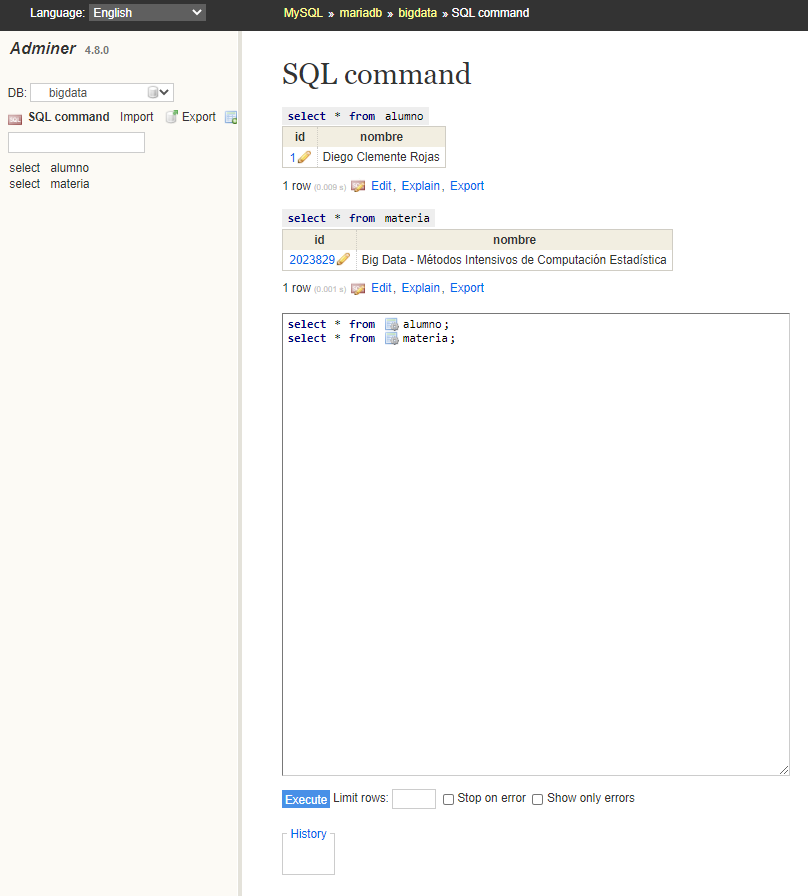

# Maria DB con Adminer

Este `docker-compose` usa la imagen `mariadb:10.5.9` y el gestor de base de datos `adminer:4.8.0`.

Para ejecutar, clone este repositorio y ubicando la línea de comandos en la carpeta [mariadb](mariadb) ejecutar el comando:

```bash
docker-compose up
```

Después de unos segundos se puede acceder al gestor de base de datos `adminer` con la URL [localhost:8081](http://localhost:8081)

Usar las siguientes credenciales donde el password es `bigdata`


NOTA: el archivo [data.sql](mariadb/scripts/data.sql) es un script que se ejecuta la primera vez que se ejecuta el container de la base de datos, por lo cual desde este archivo se puede insertar nuevos datos, crear otras tablas y en general ejecutar lo que requiera

Imagen de muestra:





# PostgreSQL con Adminer

Este `docker-compose` usa la imagen `postgres:9.6.21-alpine` y el gestor de base de datos `adminer:4.8.0`.

Para ejecutar, clone este repositorio y ubicando la línea de comandos en la carpeta [postgresql](postgresql) ejecutar el comando:

```bash
docker-compose up
```

Después de unos segundos se puede acceder al gestor de base de datos `adminer` con la URL [localhost:8082](http://localhost:8082)

Usar las siguientes credenciales donde el password es `bigdata`


NOTA: el archivo [data.sql](postgresql/scripts/data.sql) es un script que se ejecuta la primera vez que se ejecuta el container de la base de datos, por lo cual desde este archivo se puede insertar nuevos datos, crear otras tablas y en general ejecutar lo que requiera

Imagen de muestra:


